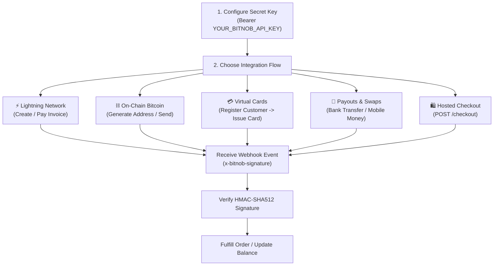

# Bitnob API & Fintech Infrastructure Integration Skill

This skill guides you through integrating Bitnob (`https://api.bitnob.co/api/v1`) into web and mobile backends. It covers Lightning Network micropayments, on-chain Bitcoin transactions, virtual USD Visa/Mastercard issuance, customer KYC onboarding, local African fiat disbursements (bank & mobile money), hosted checkouts, and HMAC-SHA512 webhook verification.

---

## Core Bitnob Rules & Directives

1. **API Key Security & Environment Isolation**:
   - Production and Sandbox API keys use the same base endpoint (`https://api.bitnob.co/api/v1`).
   - Your API Secret Key (`sk_live_...` or `sk_test_...`) must **only** reside on backend servers or environment variables (`BITNOB_API_KEY`).
   - Never expose API keys in client-side code, mobile bundles, or version control.

2. **Authentication Header**:
   - Every HTTP request must pass the API key as a Bearer token in the `Authorization` header:
     ```http
     Authorization: Bearer YOUR_BITNOB_API_KEY
     Content-Type: application/json
     Accept: application/json
     ```

3. **Units & Precision**:
   - **Lightning Network / Satoshis**: Invoices and payments often deal in `satoshis` (1 BTC = 100,000,000 sats) or fractional BTC depending on endpoint parameters.
   - **Fiat & Cards**: Card funding and transactions represent amounts in standard cents or major/minor currency units as specified in each endpoint schema. Always verify required precision per endpoint.

4. **Customer Prerequisite for Virtual Cards & Payouts**:
   - Virtual cards and certain payout routes require an existing `customerId` created via `POST /customers`. Always register/fetch the customer profile before issuing cards.

5. **Mandatory HMAC-SHA512 Webhook Verification**:
   - Bitnob signs webhook payloads using your Webhook Secret Key passed in the `x-bitnob-signature` header.
   - Always verify the signature against the **raw, unparsed request body string** before processing events.

---

## Standard Integration Workflows



### Workflow 1: Lightning Network (Invoices & Settlements)
1. **Create Invoice**: Send `POST /wallets/ln/createinvoice` with `customerEmail`, `satoshis` or `amount`, and `description`.
2. **Present BOLT11 / QR**: Supply `payment_request` (BOLT11 string) to the user for instant scanning.
3. **Pay Invoice (Outbound)**: Send `POST /wallets/ln/pay` with `request` (BOLT11 string) to settle payments instantly.
4. **Decode Invoice**: Inspect destination and amount with `POST /wallets/ln/decodepayreq` before confirming outgoing transfers.
> See [lightning_and_bitcoin.md](./references/lightning_and_bitcoin.md) for step-by-step requests and schemas.

### Workflow 2: On-Chain Bitcoin (Receive & Send)
1. **Generate Address**: Call `POST /addresses/generate` with `customerEmail` and `label` to obtain a dedicated BTC address.
2. **Send BTC (Outbound)**: Call `POST /wallets/btc/send` with `satoshis`, `address`, and `priority` (`slow`, `medium`, `fast`).
3. **Query Transaction**: Check on-chain confirmations and status via `GET /transactions/{id}`.
> See [lightning_and_bitcoin.md](./references/lightning_and_bitcoin.md).

### Workflow 3: USD Virtual Card Issuance & Management
1. **Create Customer**: Call `POST /customers` with `email`, `firstName`, `lastName`, `phoneNumber`, and address details.
2. **Issue Virtual Card**: Call `POST /cards/virtual` passing `customerId`, `currency` (`USD`), and initial `amount`.
3. **Card Lifecycle**:
   - **Fund Card**: `POST /cards/virtual/{id}/fund`
   - **Withdraw Funds**: `POST /cards/virtual/{id}/withdraw`
   - **Freeze / Unfreeze**: `POST /cards/virtual/{id}/freeze` / `POST /cards/virtual/{id}/unfreeze`
   - **Card Transactions**: `GET /cards/virtual/{id}/transactions`
> See [virtual_cards.md](./references/virtual_cards.md) for KYC fields and card management flows.

### Workflow 4: African Fiat Payouts & Currency Swaps
1. **Fetch Supported Banks**: Call `GET /payouts/banks?country={countryCode}` (e.g., `NG`, `GH`, `KE`).
2. **Initiate Payout**: Call `POST /payouts` with destination account number, bank code/mobile money network, `amount`, and `currency`.
3. **Instant Swap**: Call `POST /swap` to exchange between BTC, USD, and supported local fiat currencies.
> See [payouts_and_swaps.md](./references/payouts_and_swaps.md).

### Workflow 5: Secure Webhook Processing
1. Capture the **raw HTTP body buffer/string** before body parsers mutate it.
2. Compute the HMAC-SHA512 hash using your Bitnob Webhook Secret Key.
3. Compare the computed hash to `req.headers['x-bitnob-signature']` using timing-safe comparison.
4. Return HTTP `200 OK` promptly, then dispatch business logic according to `event`:
   - `lightning.success` / `btc.received`: Credit customer wallet or mark order fulfilled.
   - `virtualcard.transaction`: Record debit/credit or card transaction update.
   - `payout.successful` / `payout.failed`: Finalize disbursement ledger.
> See [webhook_handling.md](./references/webhook_handling.md) for Express, Next.js, FastAPI, and Go implementations.

---

## Reference Guides Index

| Topic | Reference Document |
| :--- | :--- |
| **REST API Specification** | [api_reference.md](./references/api_reference.md) |
| **Lightning Network & On-Chain Bitcoin** | [lightning_and_bitcoin.md](./references/lightning_and_bitcoin.md) |
| **Virtual Card Issuance & Lifecycle** | [virtual_cards.md](./references/virtual_cards.md) |
| **Payouts, Mobile Money & Swaps** | [payouts_and_swaps.md](./references/payouts_and_swaps.md) |
| **Webhook Security & HMAC Verification** | [webhook_handling.md](./references/webhook_handling.md) |
| **Multi-Language Code Examples** | [code_examples.md](./references/code_examples.md) |

---

## Integration Checklist

Before launching your Bitnob integration to production:

- [ ] **Secret Key Protection**: `BITNOB_API_KEY` is loaded from a secure secrets store or `.env` and never exposed on the frontend.
- [ ] **Bearer Header Set**: HTTP requests pass `Authorization: Bearer <API_KEY>` and `Content-Type: application/json`.
- [ ] **Customer KYC Verification**: Customer profiles are created via `POST /customers` before creating virtual cards or restricted payouts.
- [ ] **Raw Body Webhook Verification**: `x-bitnob-signature` is verified against the raw request body string using HMAC-SHA512.
- [ ] **Webhook Idempotency**: Handlers verify transaction references or event IDs to prevent double-crediting on retried webhook deliveries.
- [ ] **Error & Status Handling**: Backends handle HTTP `400` (Validation), `401` (Unauthorized), `422` (Unprocessable Entity), and `500` gracefully.

