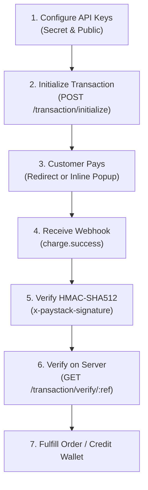

# Paystack Payments & API Integration Skill

This skill guides you through integrating Paystack into web and mobile backends. It covers end-to-end payment initialization, server-side transaction verification, HMAC-SHA512 webhook security, recurring subscriptions, automated bank transfers/payouts, and Dedicated Virtual Accounts (DVA).

---

## Core Paystack Rules & Directives

1. **Secret Key Server-Side Only**:
   - `sk_live_...` and `sk_test_...` must **only** reside on your backend server.
   - `pk_live_...` and `pk_test_...` are public keys for client-side popups (Paystack Inline).
2. **Always Use Currency Subunits**:
   - Amounts sent to the Paystack API must be represented as **integers in the lowest currency subunit**:
     - **NGN**: multiply by 100 (e.g. `₦2,500.00` $\rightarrow$ `250000` kobo)
     - **GHS**: multiply by 100 (e.g. `GH₵50.00` $\rightarrow$ `5000` pesewas)
     - **USD / ZAR / KES**: multiply by 100 (e.g. `$10.00` $\rightarrow$ `1000` cents)
3. **Never Fulfill on Frontend Redirects**:
   - Always verify payment status via **Server-Side Verification** (`GET /transaction/verify/:reference`) or **Webhook Notifications** (`charge.success`).
4. **Mandatory HMAC-SHA512 Webhook Verification**:
   - Always verify the `x-paystack-signature` header against the **raw, unparsed request body**.

---

## Standard Integration Workflows

### Workflow 1: Standard Checkout & Payment Verification
1. **Initialize Transaction**: Call `POST https://api.paystack.co/transaction/initialize` with:
   - `email`: Customer email address
   - `amount`: Amount in subunits (e.g., `500000` for ₦5,000)
   - `reference`: Unique idempotency string generated by your app
   - `callback_url`: Return URL after checkout
2. **Direct User to Checkout**: Redirect user to `data.authorization_url` or use `data.access_code` with Paystack Inline JS.
3. **Server Verification**: Upon redirect to `callback_url`, fetch `GET https://api.paystack.co/transaction/verify/:reference`.
4. **Check Status**: Ensure `data.status === "success"` and `data.amount === expectedAmount` before granting value.
> See [payment_flows.md](./references/payment_flows.md) for complete code examples in TypeScript, Python, and Go.

### Workflow 2: Secure Webhook Processing
1. Capture the **raw HTTP body buffer/string** before JSON body-parsing.
2. Compute the HMAC-SHA512 hash of the raw body using your Paystack Secret Key.
3. Compare the calculated hash to `req.headers['x-paystack-signature']` using a timing-safe equality check.
4. If valid, return HTTP `200 OK` immediately, then asynchronously route the event:
   - `charge.success`: Mark order as paid.
   - `transfer.success` / `transfer.failed` / `transfer.reversed`: Update payout status.
   - `subscription.create` / `subscription.disable`: Sync recurring subscription state.
> See [webhook_handling.md](./references/webhook_handling.md) for framework-specific implementations (Express, Next.js App Router, FastAPI, Django).

### Workflow 3: Payouts & Transfers
1. **Resolve Bank Account**: Call `GET https://api.paystack.co/bank/resolve?account_number=0123456789&bank_code=058` to verify recipient name (NUBAN).
2. **Create Transfer Recipient**: Call `POST https://api.paystack.co/transferrecipient` with `type: "nuban"`, `name`, `account_number`, `bank_code`.
3. **Initiate Transfer**: Call `POST https://api.paystack.co/transfer` with `source: "balance"`, `amount` (subunits), `recipient` code, and unique `reference`.
4. **Listen for Webhook**: Finalize payout records upon receiving `transfer.success` or handle refunds upon `transfer.failed`.
> See [payouts_and_transfers.md](./references/payouts_and_transfers.md).

### Workflow 4: Dedicated Virtual Accounts (DVA)
1. **Create/Fetch Customer**: Call `POST https://api.paystack.co/customer` with `email`, `first_name`, `last_name`, `phone`.
2. **Assign Virtual Account**: Call `POST https://api.paystack.co/dedicated_account` with `customer` ID/code and preferred bank (e.g., `wema-bank`, `titan-paystack`).
3. **Reconcile Inbound Transfers**: Paystack sends a `charge.success` webhook with `channel: "dedicated_nuban"` whenever funds are transferred to the customer's virtual account.

---

## Reference Guides Index

| Topic | Reference Document |
| :--- | :--- |
| **All API Endpoints** | [api_reference.md](./references/api_reference.md) |
| **Webhook Security & Signatures** | [webhook_handling.md](./references/webhook_handling.md) |
| **Payment & Checkout Flows** | [payment_flows.md](./references/payment_flows.md) |
| **Transfers & Payouts** | [payouts_and_transfers.md](./references/payouts_and_transfers.md) |
| **Testing, Cards & Troubleshooting** | [troubleshooting_and_testing.md](./references/troubleshooting_and_testing.md) |

---

## Integration Checklist

Before releasing your Paystack integration to production, verify:

- [ ] **Secret Key Protection**: `sk_live_...` is stored exclusively in environment variables and never checked into version control.
- [ ] **Subunit Conversion**: All amounts are multiplied by 100 and cast to integers before sending to the API.
- [ ] **Idempotent References**: Every transaction initialization and transfer uses a cryptographically unique `reference`.
- [ ] **Raw Body Webhook Verification**: Webhooks verify the `x-paystack-signature` against the unparsed raw request body string.
- [ ] **Double-Verification**: The backend validates both `data.status === "success"` AND `data.amount === expectedAmount`.
- [ ] **Webhook 200 Acknowledgment**: Webhook endpoints respond with HTTP `200 OK` within 5 seconds.

