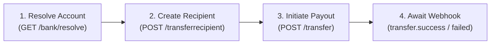

# Paystack Payouts & Transfers Guide

Paystack Transfers allow businesses to disburse funds programmatically to Nigerian bank accounts (NUBAN), Ghanaian Mobile Money wallets, South African bank accounts, and Kenyan wallets.

---

## 1. Payout Lifecycle



---

## 2. Step-by-Step Implementation

### Step 1: Resolve Account Details
Validate account numbers with the bank switch before initiating transfers:

```typescript
async function resolveAccountNumber(accountNumber: string, bankCode: string, secretKey: string) {
  const url = `https://api.paystack.co/bank/resolve?account_number=${accountNumber}&bank_code=${bankCode}`;
  const response = await fetch(url, {
    headers: { Authorization: `Bearer ${secretKey}` },
  });
  const data = await response.json();
  if (!data.status) {
    throw new Error(`Failed to resolve account: ${data.message}`);
  }
  return {
    accountName: data.data.account_name,
    accountNumber: data.data.account_number,
  };
}
```

### Step 2: Create a Transfer Recipient
```typescript
async function createTransferRecipient(name: string, accountNumber: string, bankCode: string, secretKey: string) {
  const response = await fetch('https://api.paystack.co/transferrecipient', {
    method: 'POST',
    headers: {
      Authorization: `Bearer ${secretKey}`,
      'Content-Type': 'application/json',
    },
    body: JSON.stringify({
      type: 'nuban',
      name,
      account_number: accountNumber,
      bank_code: bankCode,
      currency: 'NGN',
    }),
  });
  const data = await response.json();
  return data.data.recipient_code; // e.g. "RCP_2x5j678901234"
}
```

### Step 3: Initiate Transfer
```typescript
async function initiatePayout(recipientCode: string, amountInKobo: number, reference: string, secretKey: string) {
  const response = await fetch('https://api.paystack.co/transfer', {
    method: 'POST',
    headers: {
      Authorization: `Bearer ${secretKey}`,
      'Content-Type': 'application/json',
    },
    body: JSON.stringify({
      source: 'balance',
      amount: amountInKobo,
      recipient: recipientCode,
      reference,
      reason: 'Vendor withdrawal payout',
    }),
  });
  return await response.json();
}
```

---

## 3. Bulk Transfers

To disburse payments to hundreds of recipients in a single API call:

`POST https://api.paystack.co/transfer/bulk`
```json
{
  "currency": "NGN",
  "source": "balance",
  "transfers": [
    {
      "amount": 500000,
      "recipient": "RCP_1x2y3z",
      "reference": "payout_001",
      "reason": "Payroll Oct"
    },
    {
      "amount": 750000,
      "recipient": "RCP_4a5b6c",
      "reference": "payout_002",
      "reason": "Payroll Oct"
    }
  ]
}
```

---

## 4. Handling Transfer Webhooks

Never assume a transfer has settled until confirmed via webhook:

```typescript
function handleTransferWebhook(event: { event: string; data: any }) {
  const { reference, status, reason, amount } = event.data;

  if (event.event === 'transfer.success') {
    // 1. Mark payout as COMPLETED in DB
    // 2. Notify recipient
  } else if (event.event === 'transfer.failed' || event.event === 'transfer.reversed') {
    // 1. Mark payout as FAILED
    // 2. Re-credit user's wallet balance
    // 3. Log failure reason
  }
}
```

